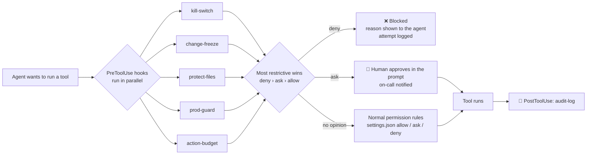

<div align="center">

# 🛡️ ai-agent-on-call

### A starter repo for agentic software projects — with the guardrails built in.

**`AGENTS.md` · Claude Code hooks · a kill switch · specs before code · an agent "offer letter" · 46 offline guardrail tests**

[](https://github.com/hanygheit/ai-agent-on-call/actions/workflows/ci.yml)
[](LICENSE)
[](presentation/)
[](https://ai-agent-on-call.lovable.app/)

</div>

---

> **9 seconds.** In April 2026 a coding agent hit a credentials problem in staging,
> found an API token in an unrelated file, and deleted a company's production database —
> and the backups stored with it — in one API call. Guardrails were advertised. Project
> rules were written. Neither stopped it.
>
> *"I guessed instead of verifying."* — the agent, explaining itself

Prompts **ask**. This repo makes hooks, permissions and process **decide**.

It is the companion to the talk **[*Before You Put an AI Agent on Call: 20 Rules for Safe Production Autonomy*](presentation/)**
(DevOpsDays Cairo 2026) — **[▶ watch the live web deck](https://ai-agent-on-call.lovable.app/)** — and a **starter you can copy into any project** where humans
and coding agents (Claude Code, Copilot, Codex, Cursor, Gemini CLI, Kiro…) work together.

---

## ⏱️ Your next 9 minutes

| ⏲ | Do this | Rule |
|---|---|---|
| **3 min** | **Write the Never list.** Copy [`AGENTS.md`](AGENTS.md) into your repo and edit the *Never* and *Stop and ask* sections. | 05 |
| **3 min** | **Install the guard.** Copy [`.claude/`](.claude/) into your repo, then run `bash scripts/test-hooks.sh`. | 15 |
| **3 min** | **Audit one token.** Find one credential your agent can reach. Scope it to one task and 15 minutes — or kill it. | 13 |

---

## 📦 What you get

| | Piece | File | What it does |
|---|---|---|---|
| 🧭 | **Team rules for every agent** | [`AGENTS.md`](AGENTS.md) · [`CLAUDE.md`](CLAUDE.md) | How we work, *Stop and ask when*, *Never*, untrusted input, incident mode, definition of done. `CLAUDE.md` imports `AGENTS.md`. |
| 🛑 | **Kill switch** | [`kill-switch.sh`](.claude/hooks/kill-switch.sh) · [`ops/agent-stop.sh`](ops/agent-stop.sh) | Any engineer, any time: every agent tool call is denied. |
| 🧊 | **Change freeze** | [`change-freeze.sh`](.claude/hooks/change-freeze.sh) · [`ops/freeze.sh`](ops/freeze.sh) | Read and investigate only — no edits, no mutating commands. |
| 🚦 | **Prod guard** | [`prod-guard.sh`](.claude/hooks/prod-guard.sh) | **DENY** irreversible commands (even if asked), **ASK** a human for anything that changes shared state. `--read-only` mode for incident agents. |
| 🔐 | **Protected files** | [`protect-files.sh`](.claude/hooks/protect-files.sh) | Secrets are never read or written; edits to the agent's own guardrails, CI and ops need approval. |
| ⏳ | **Action budget** | [`action-budget.sh`](.claude/hooks/action-budget.sh) | More than 10 commands a minute? Stop and hand over to a human. |
| 📜 | **Audit log** | [`audit-log.sh`](.claude/hooks/audit-log.sh) | One JSON line per action *and* per blocked attempt, stamped with the policy version. |
| 📣 | **Notify on-call** | [`notify-oncall.sh`](.claude/hooks/notify-oncall.sh) | Agent waiting for approval → Slack / Teams message. |
| 🎛️ | **One config file** | [`.claude/guardrails.env`](.claude/guardrails.env) | All deny/ask patterns, protected paths and budgets in one place. Tune this, not the scripts. |
| 📝 | **Plan-first skill** | [`.claude/skills/plan-feature/`](.claude/skills/plan-feature/SKILL.md) | Ticket → `docs/specs/<ticket>.md` → **stop for approval** → then code. |
| 🔎 | **Read-only on-call agent** | [`.claude/agents/oncall-triage.md`](.claude/agents/oncall-triage.md) | Evidence → likely cause → proposal + rollback. Enforced read-only by a hook. |
| 🤝 | **The agent "offer letter"** | [`ops/agent-offer-letter.yaml`](ops/agent-offer-letter.yaml) | Reports to, gear, probation, access, *never*, limits, review, termination. |
| 📚 | **Docs that agents can find** | [`docs/specs/`](docs/specs/) · [`docs/adr/`](docs/adr/) · [`docs/runbooks/`](docs/runbooks/) | Templates plus a worked example (PAY-142) and runbooks split into *investigate / decide / apply*. |
| ✅ | **Guardrails tested in CI** | [`scripts/test-hooks.sh`](scripts/test-hooks.sh) · [`ci.yml`](.github/workflows/ci.yml) | 46 offline tests, `shellcheck`, config validation — the agent doesn't grade its own homework. |
| 🔒 | **Protected main** | [`scripts/protect-main.sh`](scripts/protect-main.sh) · [`CODEOWNERS`](.github/CODEOWNERS) | Branch protection in one command; agent config is CODEOWNERS-reviewed. |

---

## 🚀 Use it as the starter for your project

### Option A — new project from this template
Click **Use this template** on GitHub *(repo owner: enable it under Settings → General → Template repository)*, or:

```bash
gh repo create my-service --template hanygheit/ai-agent-on-call --private --clone
cd my-service
bash scripts/init-starter.sh my-service --owner @your-org/platform
```

`init-starter.sh` renames the project, sets your CODEOWNERS team, and removes the
PAY-142 sample code, spec and runbook — keeping every template and guardrail.
(Add `--keep-sample` to keep the worked example.)

### Option B — add the guardrails to an existing repo

```bash
git clone https://github.com/hanygheit/ai-agent-on-call /tmp/aaoc
cp -r /tmp/aaoc/.claude /tmp/aaoc/AGENTS.md /tmp/aaoc/CLAUDE.md /tmp/aaoc/ops .
mkdir -p scripts docs/specs && cp /tmp/aaoc/scripts/test-hooks.sh scripts/ && cp /tmp/aaoc/docs/specs/_TEMPLATE.md docs/specs/
cat /tmp/aaoc/.gitignore >> .gitignore
bash scripts/test-hooks.sh
```

### Then customize (15 minutes)

- [ ] **`AGENTS.md`** — replace the `CUSTOMIZE` lines: what the service is, stack, commands.
- [ ] **`.claude/guardrails.env`** — add the CLIs *your* platform uses (cloud CLIs, DB clients, deploy tools) to `DENY_PATTERNS` / `ASK_PATTERNS`.
- [ ] **`.claude/settings.json`** — adjust the `permissions.allow` list to your test/build commands.
- [ ] **`ops/agent-offer-letter.yaml`** — name the on-call rotation, pin the model you evaluated, sign it.
- [ ] **`.github/CODEOWNERS`** — your platform team owns `.claude/`, `AGENTS.md`, `ops/`.
- [ ] **Branch protection** — `bash scripts/protect-main.sh <owner>/<repo>`.
- [ ] **Notifications** — `export ONCALL_WEBHOOK_URL=…` (or put it in `.claude/settings.local.json` → `env`). Never commit it.
- [ ] Run `bash scripts/test-hooks.sh` — add a test for every pattern you add.

---

## 🧠 How the guardrails work



Every hook receives the tool call as JSON on stdin and answers **allow / ask / deny**
([Claude Code hooks reference](https://code.claude.com/docs/en/hooks)). Staying silent
means "no opinion" — the normal permission rules in `settings.json` still apply.

**Design choices worth knowing**

- **Fail closed.** Claude Code treats a crashing hook as *non-blocking*. So `_lib.sh`
  exits `2` (hard block) if `jq` or the config is missing — a broken guardrail stops the
  agent instead of silently disappearing.
- **Hooks run via `bash …`**, so they work even if executable bits are lost (e.g. files
  uploaded through the GitHub web UI).
- **Denials are logged too**, not just executed actions — the audit trail shows what the
  agent *tried*.
- **The agent can't quietly edit its own guardrails**: `.claude/`, `AGENTS.md`, CI and
  `ops/` edits require approval, and CODEOWNERS requires a platform review on the PR.

### Try it without an agent

```bash
# What would prod-guard say to the PocketOS call?
jq -n --arg c 'curl -X POST https://backboard.railway.app/graphql -d "mutation { volumeDelete(volumeId: \"v1\") }"' \
  '{tool_name:"Bash", tool_input:{command:$c}}' | bash .claude/hooks/prod-guard.sh | jq .

# Pull the kill switch, watch everything get denied, release it
ops/agent-stop.sh "incident drill"
echo '{"tool_name":"Bash","tool_input":{"command":"ls"}}' | bash .claude/hooks/kill-switch.sh | jq -r .hookSpecificOutput.permissionDecision
ops/agent-start.sh

# Run the whole suite
bash scripts/test-hooks.sh
```

---

## 🗂️ Repository structure

```text
ai-agent-on-call/
├─ AGENTS.md                     # rules every agent reads (cross-tool)
├─ CLAUDE.md                     # @AGENTS.md + Claude Code specifics
├─ .claude/
│  ├─ settings.json              # permissions + hook wiring (shared, committed)
│  ├─ settings.local.json.example# personal settings template (real file is gitignored)
│  ├─ guardrails.env             # ← the one file you tune: patterns, paths, budgets
│  ├─ hooks/                     # 7 guardrail hooks + _lib.sh
│  ├─ skills/plan-feature/       # /plan-feature: spec first, stop for approval
│  └─ agents/oncall-triage.md    # read-only incident subagent
├─ docs/
│  ├─ the-20-rules.md            # every rule → the file that implements it
│  ├─ specs/                     # _TEMPLATE.md + PAY-142.md (the plan the agent wrote)
│  ├─ adr/                       # _TEMPLATE.md, 0001 operating model, 0007 retry policy
│  └─ runbooks/                  # kill switch, checkout-api rollback
├─ ops/
│  ├─ agent-offer-letter.yaml    # the agent's contract
│  ├─ agent-stop.sh / agent-start.sh   # kill switch on / off
│  └─ freeze.sh                  # change freeze on / off / status
├─ src/ + test/                  # sample service: PAY-142 webhook retries (TypeScript, zero deps)
├─ scripts/
│  ├─ test-hooks.sh              # 46 offline guardrail tests (CI)
│  ├─ init-starter.sh            # make this starter your project
│  └─ protect-main.sh            # GitHub branch protection via gh
├─ .github/                      # CODEOWNERS, PR template, CI workflow
└─ presentation/                 # the DevOpsDays Cairo 2026 deck, PDF, speaker script
```

---

## 🧱 The five gates, twenty rules

| Gate | Question | Rules | In this repo |
|---|---|---|---|
| **I · Lead** | Who is leading? | 01 train it like a skill · 02 outcome, not a command · 03 plan first · 04 small diffs | `AGENTS.md`, `plan-feature` skill, spec template |
| **II · Context** | What does it know? | 05 AGENTS.md · 06 discoverable architecture · 07 plans in .md · 08 setup in Git | `AGENTS.md`, `docs/`, CODEOWNERS |
| **III · Isolate** | Where does its work land? | 09 one task/branch/worktree · 10 protected main · 11 independent CI · 12 untrusted input | `protect-main.sh`, CI, `AGENTS.md` |
| **IV · Bound** | What can it touch? | 13 read-only + short-lived tokens · 14 propose, don't apply · 15 hooks decide · 16 stop button first | the hooks, `guardrails.env`, `ops/` |
| **V · Prove** | Has it earned more? | 17 no evidence, no action · 18 audit + pinned versions · 19 shadow mode · 20 gears + a human owner | audit log, offer letter, triage agent |

Full mapping: **[docs/the-20-rules.md](docs/the-20-rules.md)**.

---

## 🤖 Works with other coding agents

- **`AGENTS.md`** is the shared instruction file read by many coding agents (GitHub
  Copilot's coding agent, OpenAI Codex, Cursor, and others — check your tool's docs).
  Keep tool-specific extras in their own files, as `CLAUDE.md` does.
- **The hooks are Claude Code–specific**, but the scripts are plain bash reading JSON:
  the same `guardrails.env` patterns can back other tools' pre-execution hooks, a
  pre-commit hook, or a CI policy step.
- **Docs, specs, ADRs, runbooks, the offer letter and branch protection** are tool-agnostic.

---

## ⚠️ Honest limits: a seatbelt, not a sandbox

Hooks pattern-match commands and paths for Claude Code sessions on this checkout. An agent
can phrase a command the patterns don't catch, and agents running elsewhere (CI, cloud
sessions, other tools) don't run these hooks. The real outer wall is always:

1. **IAM / RBAC** — the agent's credentials physically cannot do the dangerous thing.
2. **Short-lived, task-scoped tokens** — never a token the agent *found* in a file.
3. **Platform policy** — branch protection, admission controllers, cloud org policies.
4. **Backups in a separate failure domain** — PocketOS lost its backups with its volume.

Use this repo to make the *safe path the default path*, then enforce the hard limits in IAM.

---

## 🧰 Requirements

- `bash` (macOS default 3.2 works), `jq`, `git` — for the hooks and tests
- Node.js ≥ 22.6 — only for the sample service (TypeScript runs natively, no build step)
- [Claude Code](https://code.claude.com/docs/en/overview) — to use the hooks, skill and subagent
- Windows: use WSL or Git Bash
- Optional: `shellcheck`, GitHub CLI (`gh`) for `protect-main.sh`

```bash
npm test                     # sample service tests
bash scripts/test-hooks.sh   # guardrail tests
```

---

## 🎤 The talk

- **▶ Live web deck:** **[https://ai-agent-on-call.lovable.app](https://ai-agent-on-call.lovable.app/)** — present or browse it in any browser
- **[presentation/](presentation/)** — slides (PPTX + PDF) and the verbatim speaker script

> Agents can act. **Accountability stays human.**

## 🙌 Contributing

Issues and PRs welcome — especially new deny/ask patterns (with a test in
`scripts/test-hooks.sh`) and equivalents for other agent tools. Agent-authored PRs are
welcome too: follow `AGENTS.md`, link a spec, keep the `Co-Authored-By` trailer.

## 📄 License

[MIT](LICENSE) © 2026 [Hany Saad](https://www.linkedin.com/in/hanysaad/) · Senior Software Engineering Manager, ITWorx
